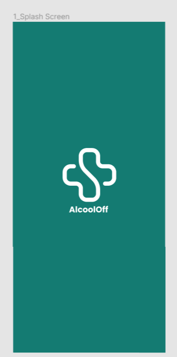

<div align="center">
  
  <h1>AlcoolOff</h1>
  <p>Liberte-se do álcool, viva plenamente </p>
  <p>
    
  </p>
</div>

# 👀 About

O app "AlcoolOff" integra inteligência artificial para proporcionar uma experiência personalizada e eficaz no combate ao alcoolismo. A IA é utilizada para adaptar as informações sobre o alcoolismo, oferecer ferramentas de autoajuda personalizadas e sugerir recursos de apoio com base nas necessidades individuais. Com a inteligência artificial, o app se torna uma ferramenta dinâmica e inovadora, proporcionando suporte relevante e eficiente para aqueles que buscam superar o vício em álcool.

<div align="center">
   
</div>

<div align="center">
  <video width="500" height="500" controls>
  <source src="src/assets/videocover.mp4" type="video/mp4">
  Seu navegador não suporta o elemento de vídeo.
</video>
</div>


<br>
<br>


# 🚀 Technologies

  - [Node.js](https://nodejs.org/en/)
  - [Expo](https://expo.io/)  
  - [React Native](https://reactnative.dev/)
  - [TypeScript](https://www.typescriptlang.org/)
  - [ESlint](https://eslint.org/)
  - [Prettier](https://prettier.io/)
  - [EditorConfig](https://editorconfig.org/)


## 💻 Getting started

### Requirements

- [Node.js](https://nodejs.org/en/)
- [Expo](https://expo.io/)  
- [Yarn](https://classic.yarnpkg.com/) or [NPM](https://www.npmjs.com/)

### Installing and running the project

*Clone the project and access the folder*

```bash
$ git clone https://github.com/pedropaxe/AlcoolOff-HackthonPact.git
$ cd AlcoolOff-HackthonPact
```

*Follow the steps below*

```bash
# Install the dependencies
$ yarn install

# Make a copy of '.env.example' to '.env'
# and set with YOUR environment variables.
$ cp  .env API KEY

# Finally, run the api service in a development environment :)
$ yarn start

# Well done, PlantManager is started!
```
<br>

## 📝 License

This project is licensed under the MIT License - see the [LICENSE](LICENSE) file for details.

<hr>
<div align="center">
  <sub>Copyright © 2023-present, #CHATDIVE HACKATHON.</sub>
</div>
<hr>
